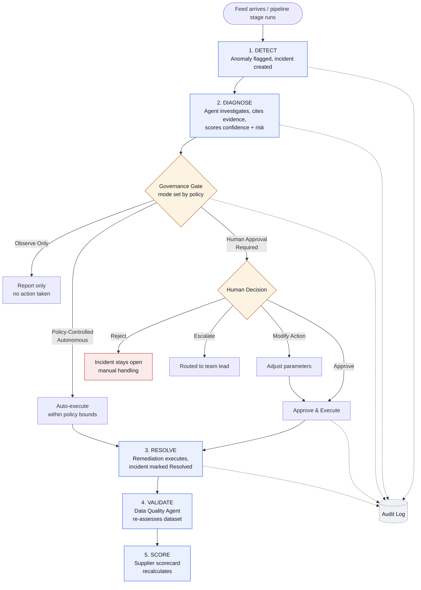

# Agentic Data Reliability Command Center

A governance-first monitoring console for AI agents that triage supplier data-feed failures and ETL pipeline incidents — every agent action is evidence-backed, confidence-scored, and gated by a configurable human-approval policy.

> **Note on scope:** the current build (`command-center.html`) is a single-file, front-end-only prototype with mock data. This README documents its architecture as a reference, and lays out what's needed to turn it into a real, production system.

---

## 1. The use case

Enterprises ingest data feeds from dozens of external suppliers (POS, logistics, product catalogs, clickstream, etc.). Those feeds fail in predictable ways — late delivery, volume anomalies, schema drift, constraint violations — and today a human DataOps engineer manually triages each one.

This product puts three specialized AI agents in front of that triage work, and makes the *governance* around their autonomy the core selling point:

- Every agent decision carries an evidence trail (systems checked, historical precedent, confidence score).
- Every agent runs under an explicit approval mode — nothing acts on production data without the policy allowing it.
- Every action, approved or not, is permanently logged in an audit trail tied back to a named, versioned policy.

**Primary persona:** DataOps Lead / Data Governance owner who needs to trust and supervise agentic automation, not just watch a dashboard.

---

## 2. The three agents

| Agent | Responsibility | Default governance mode |
|---|---|---|
| **Data Intake & Anomaly Detection Agent** | Monitors scheduled supplier feeds against a learned historical delivery/volume baseline | Human Approval Required |
| **ETL Resolution Agent** | Diagnoses pipeline stage failures, correlates against past incidents, proposes remediation | Human Approval Required |
| **Data Quality & Supplier Intelligence Agent** | Post-ETL quality scoring and supplier scorecard maintenance | Observe Only |

### Governance modes (the core primitive)

- **Observe Only** — agent investigates and reports, takes no action.
- **Human Approval Required** — agent recommends an action; a human must approve/reject before it executes.
- **Policy-Controlled Autonomous** — agent executes automatically within the bounds of a specific, pre-approved policy (e.g. accepting non-breaking, additive schema changes).

Every policy (e.g. `DQ-POL-017`, quarantine-and-continue) declares which mode governs it, which pipelines it applies to, and who owns it. This mapping is what should ultimately live in a real policy engine, not the front end.

---

## 3. The core workflow

The app encodes its own end-to-end journey via the "Core Journey" stepper shown on every relevant screen: **Detect → Diagnose → Resolve → Validate → Score**. The full branching logic — what happens at the governance gate, and the four possible human decisions — is shown below.



Audit logging (dashed lines above) runs continuously alongside every stage, whether an action is automatic or human-approved.

### 3.1 Detect — Supplier Monitor

The standing surveillance layer. Every supplier's actual delivery (arrival time, volume, schema) is compared against its own learned 90-day baseline each cycle.

- **Table view** — all 12 suppliers with delivery variance, SLA state, schema status, and an overall health chip (Healthy / Delayed / Volume Anomaly / Schema Change / Missing Feed / Duplicate Feed / Under Investigation), filterable by region, status, severity, SLA state, and delivery method.
- **Supplier detail (360° profile)** — 7 tabs: Overview (score trend + 5-part reliability breakdown), Feeds, Data Quality, Incidents, SLA, Score History, Contracts & Policies (which governance policies apply to this supplier).
- Any anomaly surfaced here is the same one the Data Intake Agent has flagged on the Command Center's "Needs Attention" queue — Supplier Monitor is the detail/audit view; Command Center is the action queue. Both route into the same Incident Workspace.
- Downstream effect: once an incident tied to a supplier resolves, that supplier's Incidents tab, Score History, and tier (Preferred / Approved / Monitor / At Risk) update — closing the loop back to Score.

### 3.2 Diagnose → Resolve — Pipeline Operations

Centered entirely on **`SALES_DAILY_ETL`** — the only pipeline in the demo with full stage-level detail, and the pipeline both seeded incidents live in.

**7 stages:** Landing → Schema Validation → Customer Validation → Product Mapping → Transformation → Business Rules → Warehouse Load.

1. **Diagnose** — a stage fails a check (e.g. Customer Validation rejects 1,248 records on `CUSTOMER_ID NOT NULL`). The ETL Resolution Agent isolates the affected records, confirms their batch origin, checks whether downstream stages depend on them, searches the knowledge base for precedent, and simulates the fix against a staging replica. Output: a recommendation + confidence score + risk rating, citing the closest historical matches (91%, 84%, 78% similarity in the demo).
2. **Governance gate** — the applicable policy (`DQ-POL-017`) sets Human Approval Required, so the recommendation queues for a human rather than executing.
3. **Human decision** — Approve & Execute / Modify Action / Escalate / Reject, each producing a distinct, separately audited outcome.
4. **Resolve** — on approval, remediation runs with a live timestamped execution log (records quarantined → checkpoint restored → pipeline resumed → downstream stages complete), and the incident is marked Resolved.

### 3.3 Validate → Score

- **Validate** (Data Quality view) — the Data Quality Agent re-assesses the affected dataset; the specific failed rule (e.g. `DQ-001`) flips status, and the dataset's overall quality score recalculates across the 6 quality dimensions.
- **Score** (Supplier Scorecards) — the involved supplier's reliability score, tier, and breakdown recalculate, feeding into "Preferred candidate" or "At Risk" watchlists for the next review cycle.

---

## 4. Current prototype — technical reference

### Stack
Plain HTML + CSS + vanilla JS in a single file. No framework, no build step, no backend. All data is hard-coded in JS objects/arrays and mutated in memory (`STATE`). Fonts loaded from Google Fonts CDN; everything else is self-contained.

### Running it
Open the HTML file directly in a browser. No server, no install, no dependencies.

### Architecture pattern
It's a hand-rolled single-page app:

- **`STATE`** — one object holding current view, selected entities, filters, sort state, and mutable incident/pipeline status (`etlStatus`, `intakeAck`, `stageStates`, etc.).
- **`Nav.go(view, opts)`** — client-side router. Toggles `.view.active` classes, updates breadcrumbs and the "Core Journey" stepper, and calls a per-view render function via `VIEW_REFRESH[view]`.
- **`render*()` functions** — one per screen/panel (`renderCommandCenter`, `renderSupplierTable`, `renderPipelineMain`, `renderIncidentWorkspace`, `renderDataQuality`, `renderScorecards`, `renderAgentsFull`, `renderKnowledge`, `renderAuditGovernance`, `renderSettings`) — each re-generates its DOM subtree from the current `STATE` + data arrays.
- **`UI`** — shared chrome helpers: modal, drawer, toast stack, dropdown toggling.
- **`Ask`** — a keyword-matching mock chat ("Ask DataOps Agent") that answers canned questions about the seeded incidents and deep-links into the relevant screen.

### Data model (mock, in-memory)
| Object | Purpose |
|---|---|
| `SUPPLIERS[]` | 12 suppliers — region, delivery method, SLA, volume baseline, score, breakdown, trend history |
| `NORTHSTAR_INCIDENT`, `ETL_INCIDENT`, `GLOBALFEEDS_ALERT` | The three seeded scenarios driving the demo, each with a full evidence/timeline/checks/confidence structure |
| `AGENTS` (via `renderAgentsFull`) | The 3 agents — scope, current task, success rate, actions today, governance mode |
| `AUDIT_LOG[]` | Every logged agent action — timestamp, agent, action, policy, mode, approver, decision, result, evidence, environment |
| `POLICIES[]` | Named/versioned governance policies (e.g. `DQ-POL-017`, `DQ-POL-004`, `DQ-POL-011`) with owner, approval mode, applicable pipelines |
| `DATASETS[]`, `DATASET_RULES{}` | Data-quality rule results per curated dataset |
| `QUALITY_DIMS[]` | The 6 quality dimensions (Completeness, Validity, Uniqueness, Consistency, Freshness, Referential Integrity) |
| `KPI_DEFS[]` | Command Center top-row metrics |
| `PIPELINE_STAGE_NAMES`, `PIPELINE_STAGES_INIT[]` | The 7-stage ETL pipeline model, hard-coded to `SALES_DAILY_ETL` |

### Two seeded incidents (what makes the demo concrete)
1. **NorthStar Data volume anomaly** — feed arrives on time but with -78.6% of expected records; agent recommends supplier re-delivery, awaiting approval.
2. **SALES_DAILY_ETL / DataSphere validation failure** — 1,248 records fail `CUSTOMER_ID NOT NULL`; ETL agent recommends quarantine-and-continue, citing 3 historically similar incidents at 91%/84%/78% match.

### Information architecture
```
Operate      → Command Center · Supplier Monitor · Pipeline Operations
Insight      → Supplier Scorecards · Agent Workspace
Governance   → Knowledge & Policies · Audit & Governance
Admin        → Settings
```

### Design system
CSS custom properties define the full token set — surface/border/text colors, semantic status colors (`--success`, `--warning`, `--critical`, `--info`), radii, and shadows. Typography is Inter (UI) + JetBrains Mono (tabular/numeric data). All status/severity/tier states render through shared chip helper functions (`statusChip`, `severityChip`, `tierChip`, `slaChip`) rather than one-off markup, so new states/colors slot in by extending `STATUS_META`.

---

## 5. Building this into a real product

To move from prototype to production, the pieces that currently live as hard-coded JS need to become real services:

### 5.1 Backend & data
- **Ingestion metadata service** — actual connectors (SFTP, API, cloud storage) reporting arrival time, checksum, byte count, schema per feed, replacing `SUPPLIERS[]`.
- **Pipeline orchestration — Dagster.** Model `SALES_DAILY_ETL`'s 7 stages as a chain of Dagster **software-defined assets** (`landing_asset → schema_validation_asset → customer_validation_asset → product_mapping_asset → transformation_asset → business_rules_asset → warehouse_load_asset`), replacing `PIPELINE_STAGES_INIT` with live materialization metadata (Dagster gives you records-in/out, duration, and errors per asset for free via run metadata).
  - The **Customer Validation** failure (`CUSTOMER_ID NOT NULL`) maps to a Dagster **asset check** on `customer_validation_asset` — a failed check is what should create the incident, mirroring `ETL_INCIDENT` in the mock.
  - The **governance gate** (pause for human approval before quarantine-and-continue) doesn't have a first-class "wait for approval" primitive in Dagster, so implement it as: the asset check failing sets an external approval-state row (e.g. in Postgres) → a **sensor** polls that state → once a human approves via your app (the Approve & Execute action), the sensor issues a `RunRequest` that re-materializes `customer_validation_asset` downstream with the quarantine logic applied. This keeps "wait for a human" outside the DAG's control flow, which is the correct place for it.
  - The `renderPipelineMiniStrip()` mock view maps directly onto Dagster's **Asset Lineage/Global Asset Graph** — you can largely mirror that visualization rather than reinvent it.
  - If you want the Knowledge Base entries to reflect the real tool, rename the mock's `LOG-AF-4471` / "Airflow run log" style entries to reference the Dagster **run ID** and **materialization** instead.
- **Compute engine — DuckDB (given the timeline).** Each Dagster asset's underlying logic is just a DuckDB SQL step reading/writing local Parquet or CSV — no warehouse account, no credentials, no network setup. It ingests the mock's supplier formats natively (NorthStar's pipe-delimited CSV, DataSphere's JSON Lines) and processes the ~1M-row `SALES_DAILY_ETL` volume in seconds. This is a build-speed decision, not a permanent one — swap DuckDB for Snowflake/BigQuery/Postgres later by changing what each asset's SQL connects to; the Dagster asset graph and the governance-gate sensor don't change.
- **Data quality engine** — a rules engine (e.g. Great Expectations, Soda, or Dagster's own asset checks) feeding `QUALITY_DIMS` / `DATASET_RULES` instead of static scores. Since you're already on Dagster, asset checks can double as both the pipeline gate *and* the source of `DATASET_RULES` — one less system to maintain.
- **Out of scope for the MVP:** Domo or any BI layer beyond the existing custom UI — it competes with the front end, not the pipeline, and isn't needed to prove out the core loop.
- **Persistent audit store** — `AUDIT_LOG` needs to be an append-only, queryable store (not an in-memory array) since it's the trust/compliance backbone of the product.

### 5.2 Agent layer
- Each agent (Intake, ETL Resolution, Data Quality) becomes an actual agent process with:
  - Tool access to the systems it currently just "checks" in the mock (SFTP logs, schema registry, ServiceNow, Jira, runbook KB, historical incident store) — plus, for the ETL Resolution Agent, read access to Dagster's GraphQL API for run/asset status and lineage.
  - A structured output contract: conclusion, confidence score, recommended action, evidence list — matching the shape already modeled in `NORTHSTAR_INCIDENT`/`ETL_INCIDENT`.
  - A **governance interceptor**: before any state-changing action executes, check the policy's approval mode (`Observe Only` / `Human Approval Required` / `Policy-Controlled Autonomous`) and route to human approval or auto-execute (i.e., trigger the Dagster sensor/RunRequest) accordingly.

### 5.3 Policy engine
- Promote `POLICIES[]` to a real, versioned policy store with an approval workflow for policy changes themselves (who can move a policy from Human-Approval to Policy-Controlled-Autonomous, and under what review).

### 5.4 Auth & multi-tenancy
- Real user identity (currently a single hard-coded persona), role-based permissions (the "Approver permissions" tag), and environment separation (Production / Pre-Production / QA) enforced server-side, not just in a dropdown.

### 5.5 Real-time layer
- Replace manual "Refresh" buttons with a push/subscription layer (WebSocket/SSE) so KPIs, attention cards, and SLA countdowns update live as agents and Dagster runs progress.

### 5.6 Notifications & escalation
- Wire the notification bell and vendor-escalation actions to real channels (email/Slack/ServiceNow ticket creation) instead of toast messages.

---

## 6. MVP build plan — Dagster + DuckDB, time-boxed

Given a short build window, this scopes down to proving the *one* incident (`ETL_INCIDENT`) the whole prototype is built around, with zero infrastructure provisioning.

**In scope:**
1. Two or three local sample files standing in for real supplier feeds (mimic NorthStar + DataSphere — a CSV and a JSON Lines file is enough).
2. The 7 `SALES_DAILY_ETL` assets in Dagster, each a DuckDB SQL step reading/writing local Parquet — run via `dagster dev`, no deployment.
3. One **asset check** on `customer_validation_asset` for the `CUSTOMER_ID NOT NULL` rule — the only failure condition the demo needs.
4. The governance-gate sensor: approval flag in a lightweight store (SQLite/Postgres) → sensor polls it → `RunRequest` re-materializes downstream once a human clicks Approve & Execute in the app. This is the piece that actually sells the use case — prioritize it over anything else.
5. Wire the audit log as a real persisted table (even just Postgres) so the Approve/Reject/Modify actions write real rows instead of the in-memory `AUDIT_LOG` array.

**Deliberately out of scope for this pass:**
- The other 9 pipelines and remaining 10 suppliers — only `SALES_DAILY_ETL` needs to be real.
- Real supplier connectors (SFTP/API pollers) — local sample files are enough to trigger the same failure.
- A managed warehouse and any BI/Domo layer — DuckDB and the existing custom UI cover it.
- Multi-environment (Pre-Prod/QA) and real auth — single environment, single approver is fine for a demo.

**Front end:** keep the existing screens/IA as-is — the interaction design (attention cards, evidence timeline, Ask agent, stepper) doesn't need to change, only its data source, once the Dagster + DuckDB pipeline is live behind it.

---

## 7. Screen-by-screen reference (appendix)

Command Center, Supplier Monitor, and Pipeline Operations are covered in Section 3 as part of the core Detect → Diagnose → Resolve → Validate → Score journey. This appendix covers the remaining six screens in full.

### 7.1 Data Quality
5 sub-tabs under one screen:
- **Quality by Dataset** — all 5 curated datasets with overall score, record count, rules total, passed/warning/failed counts. Row click → Dataset Detail, which shows the full rule-results table with per-row actions: view affected records, view lineage, jump to supplier source, jump to incident history.
- **Quality by Supplier** — the same quality metrics reshaped per-supplier (score, trend sparkline, referential integrity, validity).
- **Failed Rules** — every currently failing/warning rule across all datasets; `CUSTOMER_ID` rules specifically link straight to the DataSphere supplier and its incident history.
- **Recent Deteriorations** — entity/metric/from/to/window/cause — what got *worse* recently, distinct from what's currently broken.
- **Quality Trends** — a single 14-day rolling sparkline of enterprise-wide data quality.
- **Data Lineage modal** (reachable from several tabs) — Supplier → SFTP/API Intake → Landing Zone → Pipeline → Curated Dataset → BI Layer.

### 7.2 Supplier Scorecards
Ranked table of all 12 suppliers by composite score, sortable, with a trend sparkline and tier chip per row. Row click opens a **drawer** (not a full page) with a gauge visualization, the 5-metric breakdown, "Score Drivers" (late feeds, schema issues, PRODUCT_CODE failures, SLA compliance — populated only for suppliers with driver data, e.g. GlobalFeeds), and the AI insight text. Below the table: an auto-computed **Tier Movement Watchlist** — "Preferred tier candidates" (Approved suppliers scoring ≥85) and "Downgrade watch" (Monitor/At Risk suppliers).

### 7.3 Agent Workspace
One card per agent — status, scope, active task, last completed action, actions-today, success rate, avg resolution time, and an "awaiting approval" counter (turns amber when >0). "View Agent Activity" opens a **vertical timeline drawer** — a step-by-step trace (done/active/pending) of that agent's current investigation, explicitly captioned that no internal reasoning is exposed beyond what's already surfaced in the incident workspace — a deliberate transparency-boundary statement worth preserving in a real build.

### 7.4 Knowledge & Policies
3 sub-tabs:
- **Sources** — connected systems (ServiceNow, Jira, runbook library, etc.) with connection status, documents indexed, last sync, owner.
- **Knowledge Base** — searchable KB articles (incident write-ups, vendor communication logs, pipeline run logs), each opens a detail modal.
- **Policies** — every governance policy as a card: ID, title, version, full body, owner, effective date, approval mode, applicable pipelines.

### 7.5 Audit & Governance
The full filterable/searchable/paginated audit table (agent, action, incident, supplier, policy, mode, approver, result, environment). Row click opens a detail modal reconstructing the entire decision: trigger → evidence → recommendation → policy evaluated → human decision → system action → final outcome — effectively the "receipt" for every agent action in the app. This is the screen a real audit store (Section 5.1) needs to serve directly.

### 7.6 Settings
Six cards: Governance Defaults (per-agent approval mode), Connected Systems, Notification Preferences, Environment Configuration, Data Retention (13 months for logs, indefinite for audit/compliance — a real retention policy to actually implement), and User Permissions (role + approver rights).

### 7.7 Notable integration point
`exportTableCSV()` calls `window.claude.use('downloads')` — a Claude-artifact-specific hook for triggering file downloads. Worth knowing about if this prototype is ever adapted outside a Claude-hosted context, since that API won't exist there.

---

## 8. File reference

| File | Purpose |
|---|---|
| `command-center.html` | The complete interactive prototype — styles, markup, and all JS logic in one file |

---

## 9. MVP backend — how to run

The `reliability_pipeline/` package implements Section 6's plan: `SALES_DAILY_ETL` as 7 Dagster
software-defined assets over a single DuckDB file (`sales_pipeline.duckdb`), with a governance
gate that pauses after `customer_validation_asset` until a human approves.

**Quickest path (recommended for a fresh handoff):**

```bash
pip install -r requirements.txt
cp .env.example .env   # fill in GROQ_API_KEY_1.. and OPENROUTER_API_KEY
python run_dev.py       # starts dagster dev (:3000) AND the API (:8000) together
```

`run_dev.py` starts both long-running processes with one command, streams both logs to one
terminal prefixed `[dagster]`/`[api]`, generates the sample supplier files if they're missing,
and shuts everything down together on Ctrl+C -- including dagster's own code-server/daemon
subprocesses, which would otherwise survive independently and block the ports on the next run.
Override ports with `DAGSTER_PORT=3001 API_PORT=8001 python run_dev.py` if 3000/8000 are taken.

**Or run them separately** (useful if you want `--reload` on the API while iterating, or want
each in its own terminal):

```bash
dagster dev             # http://localhost:3000 -- all 7 assets + the sensor are visible
uvicorn reliability_pipeline.api.main:app --reload --port 8000   # in a second terminal
```

In the UI, materialize `full_pipeline_job` (or click "Materialize all"). `landing_asset` and
`schema_validation_asset` succeed; `customer_validation_asset`'s `customer_id_not_null_check`
fails on the seeded NULL `CUSTOMER_ID` rows (~80 across both supplier files) and blocks
everything past it. That failure calls the LLM (`llm_client.call_llm`) for a root-cause
narrative, writes a `pending` row to `approvals`, and a `Detected` row to `audit_log`.

Unblock it from a second terminal:

```bash
python scripts/demo_cli.py pending
python scripts/demo_cli.py approve INC-<the-incident-id>
```

`approval_sensor` (polling every 15s) picks up the `approved` row and fires a `RunRequest`
for `resume_after_approval_job`, which materializes `product_mapping_asset` onward, writes
`data/curated/daily_sales_curated.parquet`, and closes the incident with a `Resolved` row in
`audit_log`. `python scripts/demo_cli.py reject <incident-id>` closes an incident without ever
triggering the sensor -- the pipeline stays paused.

Query the trail directly with DuckDB: `python scripts/demo_cli.py audit <incident-id>`, or
`duckdb sales_pipeline.duckdb -c "select * from audit_log"`.

`full_pipeline_job` doesn't start on its own by default -- there's a `sales_daily_etl_schedule`
(`reliability_pipeline/schedules.py`) that fires it daily at 06:00 as a stand-in for a real
feed-arrival trigger (real SFTP/API pollers are out of scope for this build; there's nothing
else to watch since the sample data is static local files, not a real drop location). It's
visible under **Automation** in the Dagster UI, self-activates (`RUNNING` by default), and can
be fired immediately with the UI's "Test Schedule" button instead of waiting for 06:00.

**All three Governance Gate modes now have real code behind them** (`reliability_pipeline/policies.py`
is the policy store governance.py and business_rules_asset read from, instead of a hardcoded
string). `business_rules_asset`'s two previously-silent checks are now genuinely governed:

- `DQ-POL-018` (**Policy-Controlled Autonomous**) -- `SALES_AMOUNT < 0` violations get
  auto-accepted as refund/adjustment edge cases and logged with `approver = 'System
  (Policy-Controlled)'`, `decision = 'Auto-approved'` -- no human involved, no pipeline impact.
- `DQ-POL-019` (**Observe Only**) -- future-dated `ORDER_DATE` violations are logged with
  `approver = 'Not applicable'`, `decision = 'Not applicable'` -- flagged for monitoring, no
  action taken.
- `DQ-POL-017` (**Human Approval Required**) -- unchanged, still the `CUSTOMER_ID NOT NULL`
  incident this whole build proves out end-to-end.

All three write to the same `audit_log` (filter by `action` -- `Detected`/`Auto-Accepted`/`Observed`
via `GET /api/audit-log?action=...`), so a single pipeline run now exercises every branch of the
Governance Gate diamond in one pass, not just the human-approval one.

---

## 10. HTTP API — backend for command-center.html's shape

`reliability_pipeline/api/` is a FastAPI app shaped to match the screens documented in
sections 3, 4 and 7 above, so a future front end (or command-center.html itself, if it's
added back to this repo) has something real to call. Run it alongside `dagster dev`:

```bash
uvicorn reliability_pipeline.api.main:app --reload --port 8000
```

Interactive docs: `http://localhost:8000/docs`.

**Real, live data** (queried straight from `sales_pipeline.duckdb`/`governance.py` -- no
mocking): `GET /api/pipelines/sales-daily-etl` (stage-by-stage status), `GET /api/incidents`
+ `GET /api/incidents/{id}` (the real ETL incident, once one has been detected),
`POST /api/incidents/{id}/approve|modify|reject|escalate` (drive the governance gate over
HTTP instead of `scripts/demo_cli.py`), `GET /api/audit-log` (paginated/filterable),
`GET /api/data-quality/datasets/daily_sales_curated`, and the NorthStar Data / DataSphere
entries under `GET /api/suppliers` (enriched with live feed counts from
`landing_daily_sales`) and `GET /api/scorecards` (real score/tier, recomputed by
`warehouse_load_asset` every time an incident resolves -- see `scoring.py`; this is the
diagram's "Score" step, closing the loop that was previously mock-only end to end).

**Static mock data** (`reliability_pipeline/api/mock_data.py`), for everything the pipeline
build explicitly left out of scope: the other 10 suppliers, 2 of the 3 agents, the NorthStar
volume-anomaly and GlobalFeeds incidents, policies, the knowledge base, and 4 of the 5
curated datasets. `GET /api/command-center/kpis` and `GET /api/command-center/attention-queue`
blend both -- real incidents show up alongside the mock ones, the way the prototype's
Command Center queue is meant to.

**`POST /api/ask`** -- backend for command-center.html's "Ask DataOps Agent" widget (that
widget itself is pure client-side keyword-matching against hardcoded strings; it never calls
a backend). Same question categories (NorthStar / SALES_DAILY_ETL / GlobalFeeds / other
suppliers), but the SALES_DAILY_ETL answer is grounded in live DuckDB state instead of a
fixed string, and anything that doesn't match a known pattern falls through to a real Groq
call instead of a canned "I can't help with that." `GET /api/ask/suggestions` returns the
same 3 starter questions the prototype shows.
